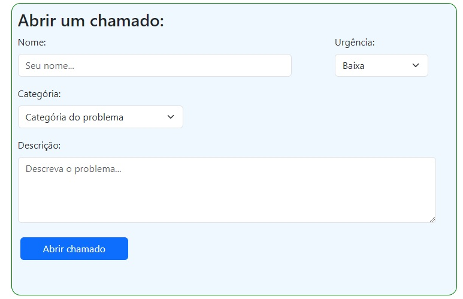
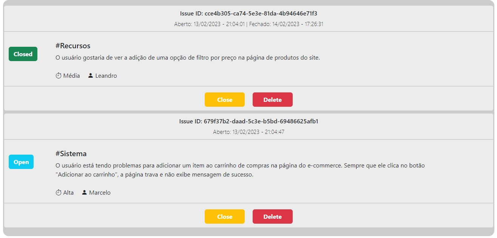

# Rastreamento de Problemas

Este é um aplicativo de rastreamento de problemas simples, a interface do usuário está dividida em duas seções.

No topo, é visível um formulário de entrada. Ao usar os campos de entrada para Nome, Urgência, Categória do problema e Descrição do problema, o usuário pode inserir novos problemas. Os problemas são armazenados no Armazenamento Local do Navegador, sendo impressa na segunda seção, como uma lista de problemas existentes.

Cada problema é impresso contendo uma ID única, data e horário de criação e os detalhes do nome, gravidade e descrição.

Além disso, cada problema tem um status atribuído. Por padrão, o status é "Open". Se um problema for resolvido, o usuário pode definir o status como "Closed" usando o botão Fechar. O problema pode ser excluído da lista (e do Armazenamento Local) clicando no botão Excluir.

## Referências

Este projeto foi criado com base em um repositório de tutoriais e foi construído seguindo um tutorial disponível em [medium](https://medium.com/).

- [Project Based Learning](https://github.com/practical-tutorials/project-based-learning)
- [Build a APP in pure JS](https://medium.com/codingthesmartway-com-blog/pure-javascript-building-a-real-world-application-from-scratch-5213591cfcd6)

## Aprendizado

- HTML5
- CSS3
- JavaScript

## Screenshots

